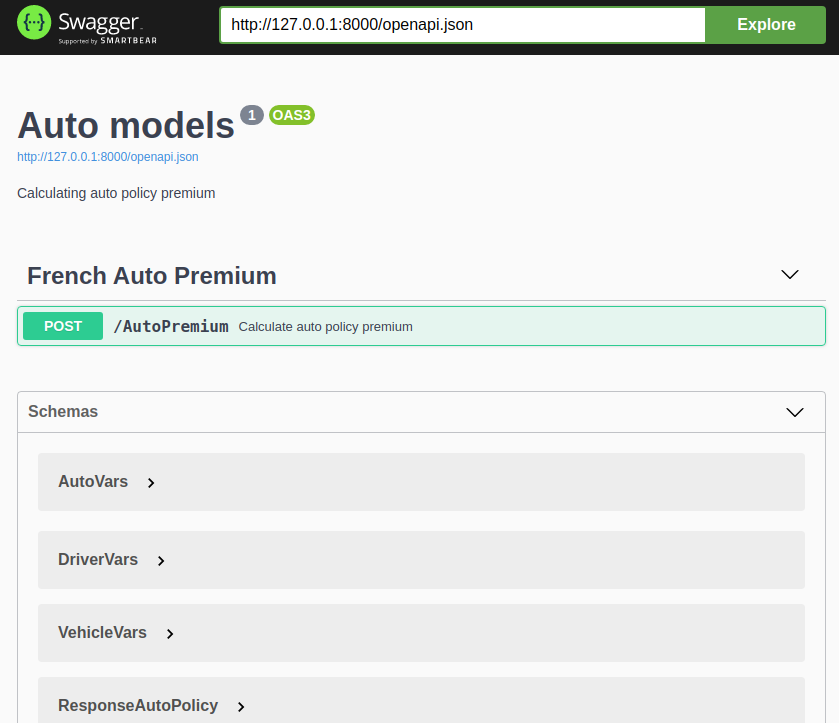
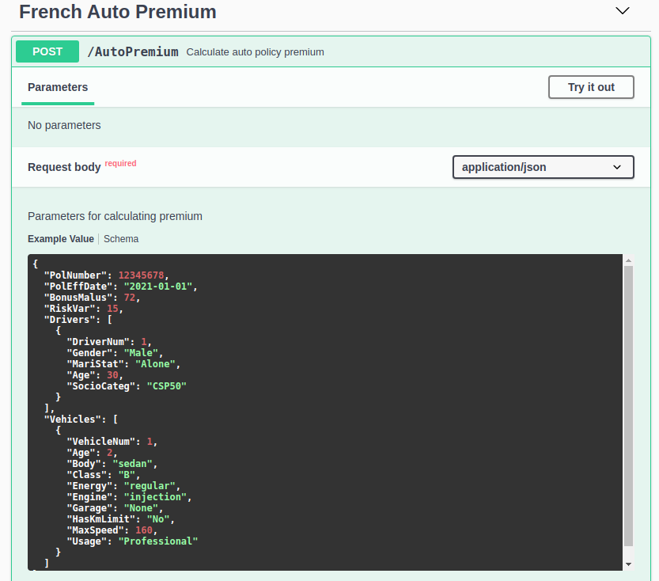
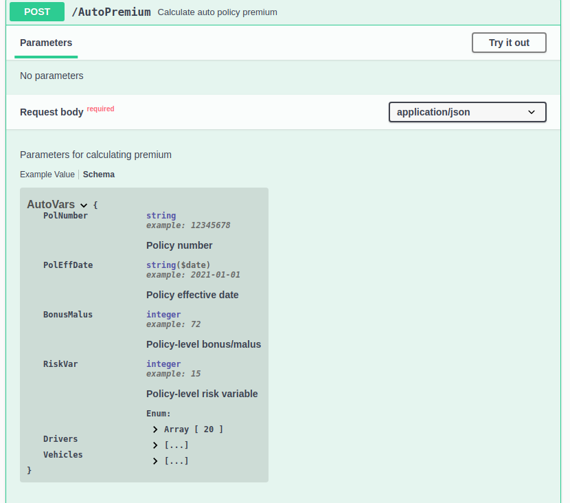
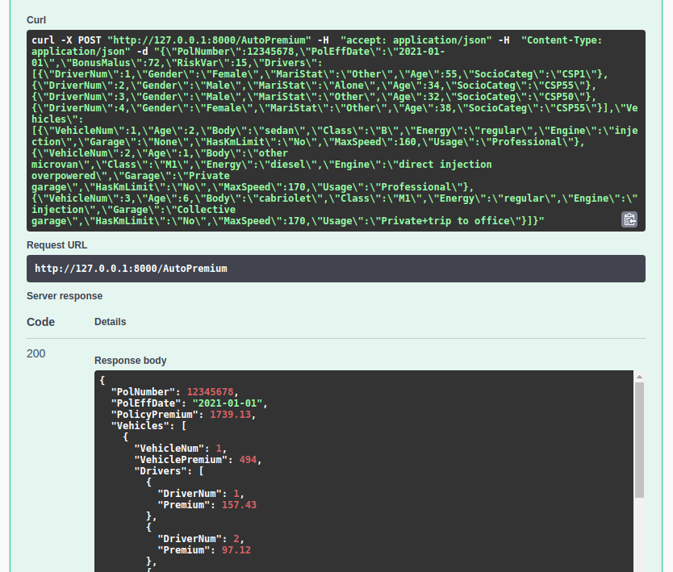
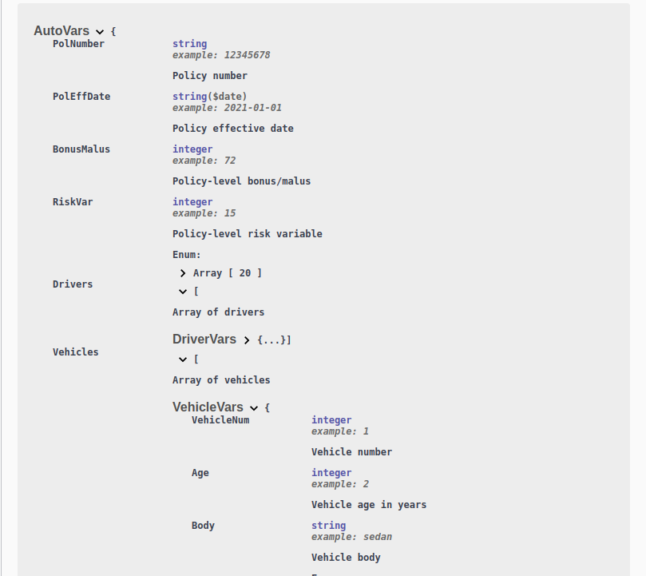

```{r setup, include = FALSE}
knitr::opts_chunk$set(warning = FALSE, message = FALSE, out.width = "100%", fig.height = 6)
knitr::opts_knit$set(root.dir = rprojroot::find_rstudio_root_file())
```

```{r}
library(purrr)
```

# Introduction

In the [`code/plumber`](https://github.com/mvanhala/illustrations/code/plumber) folder, we 
create an example of fitting a pricing model and publishing it as a Plumber API.

# Fitting model

Using the `freMPL1` data set in the `CASdatasets` package, which is a set of 
French personal auto policies from an unknown insurer, we first fit a model in 
[`code/plumber/fit_model.R`](https://github.com/mvanhala/illustrations/code/plumber/fit_model.R).

We fit a pure premium model using elastic net regularization, with parameters $\alpha = 0.5$
and $\lambda = 0.3$.

We then extracted the table of coefficients from the fitted model and saved it to an rds file.

# Defining input data structure

A key step in our construction of the API is defining an input structure. 
For this example, we conceptualized the implementation as follows. The input would 
contain the data for a single policy. A policy may have multiple drivers and/or vehicles
associated with it.

There are some variables which are policy-level, some which are driver-level, and some which
are vehicle-level.

Based on the natural structure of the data, we conceived of an input JSON object containing
the policy information, where one element is an array of drivers and another element is
an array of vehicles.

Here is a sample input object. This example has four drivers and three vehicles.

```{r, comment=NA}
cat(readr::read_file("code/plumber/input_sample.json"))
```

When we use the fitted model to calculate a premium, what we will do is 
equally assign vehicle exposures to each driver. That is, if there are for example
four drivers, one-fourth of the exposure on each vehicle will be assigned to
each vehicle. We will get the cross join of vehicles and drivers, get the model
predicted values, then multiple the model predicted value by the exposure weight
for that observation (the inverse of the number of drivers).

# OpenAPI specification

In the current CRAN release of the `plumber` package, it is not possible to use a custom
OpenAPI specification. Support for this functionality was added in the developmental GitHub
version of the package since the CRAN release, and in the next CRAN release, there will
be much more comprehensive support for custom OpenAPI specifications in `plumber`, which
should be extended to RStudio Connect.

In the meantime, we are using a [snapshot](https://github.com/rstudio/plumber/tree/b7ff05ac6bd21db3341a9a91fb90c4c581bf56b9)
of the `plumber` repo from April 2020, which supports using a custom OpenAPI specification.

In
[`code/plumber/build_spec.R`](https://github.com/mvanhala/illustrations/code/plumber/custom_spec.R),
we wrote several functions to enable the programmatic generation of the OpenAPI specification from R.
These functions automate formulaic parts of defining documentation for schemas and endpoints.

In this file, we then use the functions to define schemas and construct the OpenAPI spec, which is saved to
[`code/plumber/API/spec.yaml`](https://github.com/mvanhala/illustrations/code/plumber/API/spec.yaml).

# Plumber API code

The code for the API is in the folder
[`code/plumber/API`](https://github.com/mvanhala/illustrations/code/plumber/API).

The endpoint `AutoPremium` is defined in `plumber.R`. It has a POST method which takes a JSON input
as describe above, consisting of the data for a policy, including the arrays of drivers and vehicles.

Here is the response object for the input object above. The total policy premium is returned, along
with an array of vehicles, where each vehicle array element has the total vehicle premium
and the driver-allocated premium. Thus each vehicle array element has a driver array of length
equal to the number of drivers in the input.

```{r comment = NA}
httr::POST(
  "http://127.0.0.1:8000/AutoPremium", 
  body = httr::upload_file("code/plumber/input_sample.json")
) %>%
  httr::content("text") %>% 
  jsonlite::prettify(2) %>%
  cat()
```

In the file `entrypoint.R`, we write some code to enable to inject our custom OpenAPI specifcation.

# Deployment in Docker container

As [described](https://www.rplumber.io/articles/hosting.html) in the Plumber API documentation, 
in addition to deployment on RStudio Connect,
Plumber APIs can be hosted within Docker containers.

For this example, we deployed it in a Docker container. After writing a 
[Dockerfile](https://github.com/mvanhala/illustrations/code/plumber/API/Dockerfile),
we then built the image and spun up a container. You can test it for yourself using the 
[same commands](https://github.com/mvanhala/illustrations/code/plumber/docker_build_run.sh).

# Screenshots of Swagger UI

After the Plumber API is up and running, the Swagger UI is available to view the documentation
generated from the OpenAPI specification and to test out the API.

Here are a few screenshots of the Swagger UI for this API.

## Upon initial opening


<br>

## Testing endpoint



<br>



<br>


<br>

## Schemas



<br>


<br>

